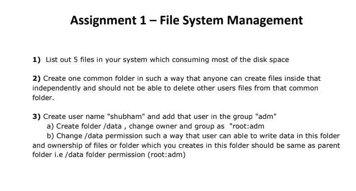
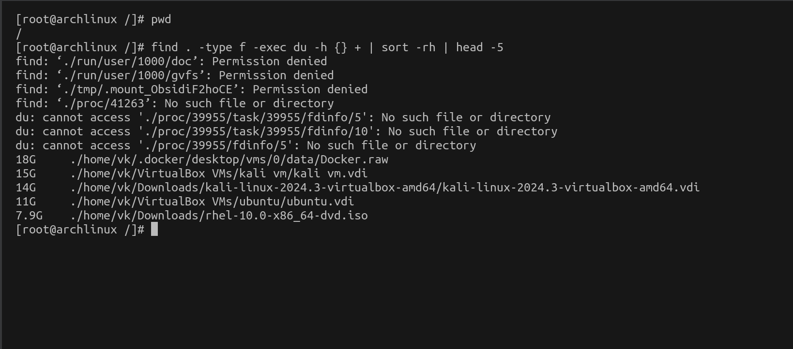
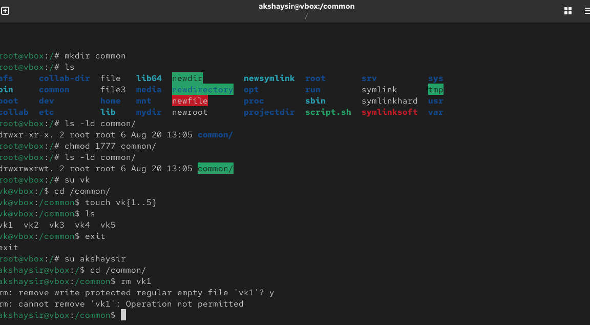
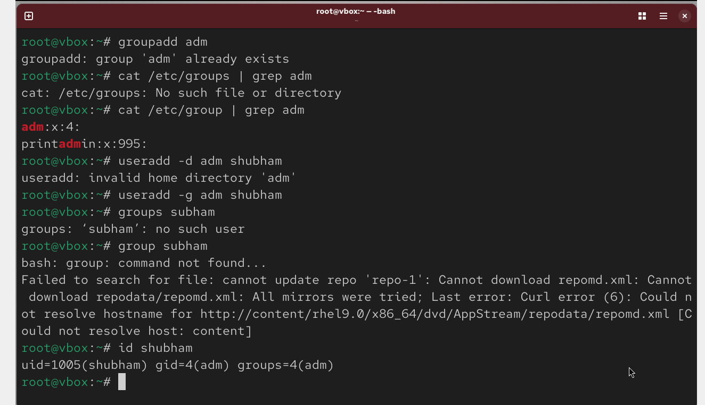
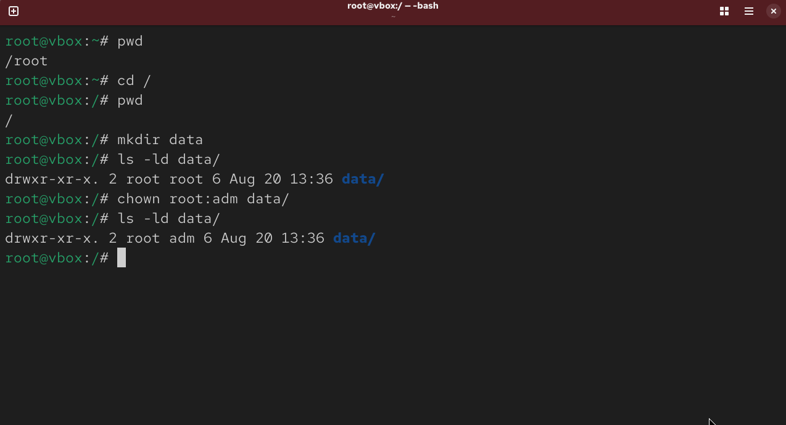
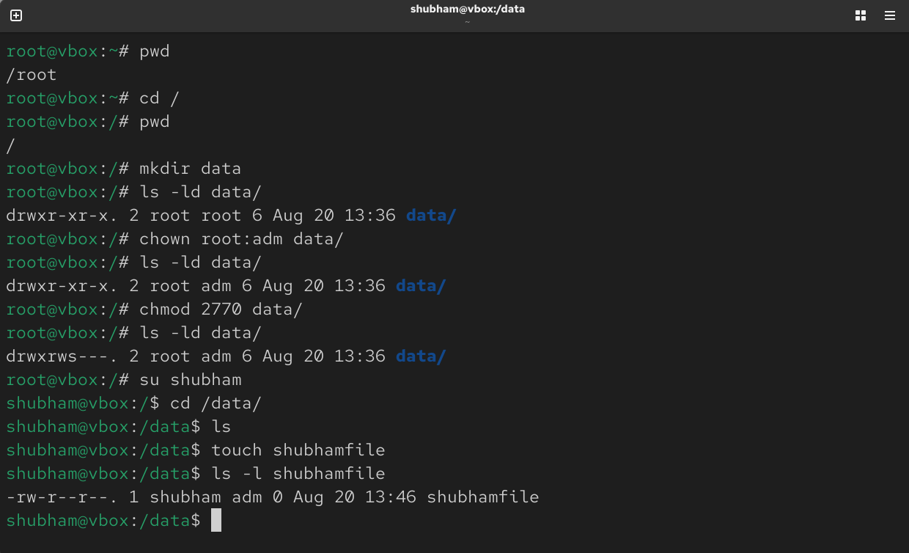

# Linux Learning Repository



---

1)

```
# find . -type f -exec du -h {} + | sort -rh | head -5
```




**Alternate approach**

```
# find . -type f -exec du -h {} \; | sort -rh | head -5 
```
---

2)



---


3a) 



---
3b)






---


